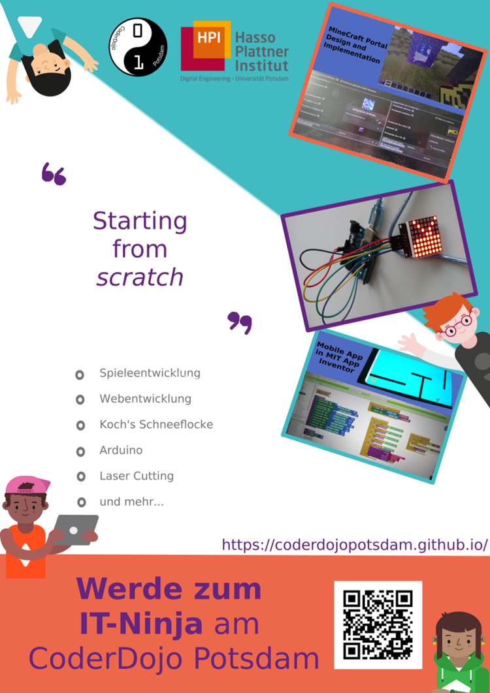
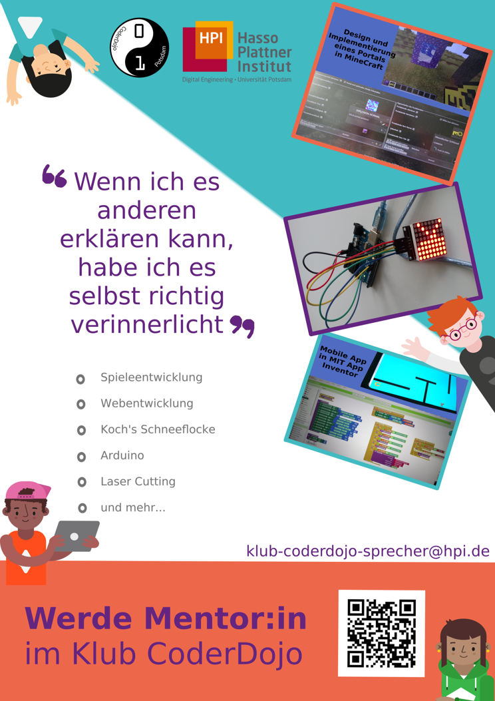
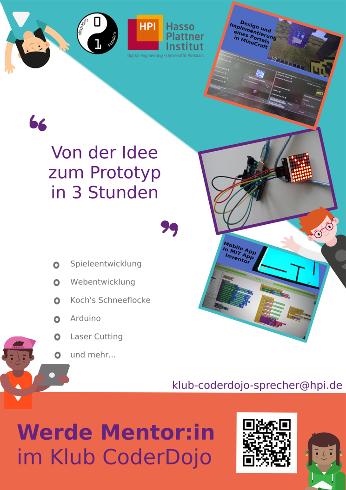
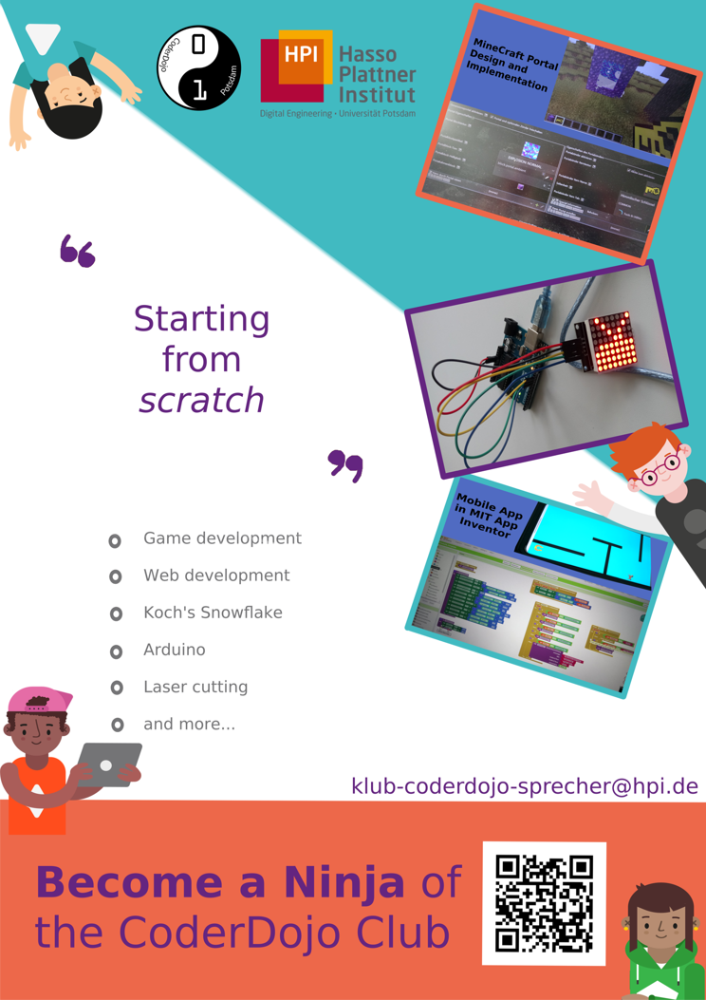

# Poster Werbung Mentoring am CoderDojo Potsdam

Diese Poster sind entstanden um neue Mentor:innen und Teilnehmer:innen für das CoderDojo anzuwerben.

Die Masterdatei enthält alle Posterbausteine, separiert in Layern. Es wurden bisher zwei deutschsprachige und eine englischsprachige Postervariante erstellt. Zudem wurde ein Poster für Schulen erstellt.

